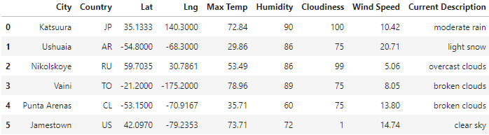

# World_Weather_Analysis

Module 6

## Overview

For this project, users will input weather preferences to find potential vacation spots and nearby hotels. From the generated list, the user will input 4 cities to create a travel itinerary.  

### How it works

Weather Database will randomly generate latitude and longitude combinations and find cities close to those locations.  It will populate a dataframe and export those city results and other relevant information to a .csv file to be used in the next step.  Here are a few rows of an example dataframe. 

Next, the Vacation Search imports the weather database and asks the user to choose their optimal temperature range for the vacation.  It will then filter the dataframe to generate a list of preferred cities and locate hotels nearby and place them in a dataframe.  An example of possible results are below. 

Vacation Search will then populate a map with the hotel, city, country and current weather information.  An example is shown here:

The last part of this project was to develop an itinerary including four cities. For this section, the user can input a starting/ending city (from the previous results in Vacation Search) and 3 stops for their vacation that could be driven, biked or walked to.  Based on the user input, it populates a map showing the trip. It will look similar to this depending on the cities chosen. 

It will show the user the hotels near the stops on their trip as well as the city, country and current weather information.  Here is an example screen shot.

It will also show the results in a dataframe.  

### Happy Vacationing!
